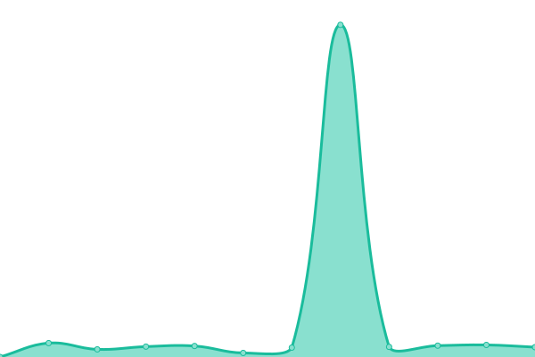

# [📈 Live Status](https://iberejr.github.io/checkpages): <!--live status--> **🟧 Partial outage**

This repository contains the open-source uptime monitor and status page for [Ibere Di Tizio Jr](https://iberejr.github.io/checkpages), powered by [Upptime](https://github.com/upptime/upptime).

With [Upptime](https://upptime.js.org), you can get your own unlimited and free uptime monitor and status page, powered entirely by a GitHub repository. We use [Issues](https://github.com/iberejr/checkpages/issues) as incident reports, [Actions](https://github.com/iberejr/checkpages/actions) as uptime monitors, and [Pages](https://iberejr.github.io/checkpages) for the status page.

<!--start: status pages-->
<!-- This summary is generated by Upptime (https://github.com/upptime/upptime) -->
<!-- Do not edit this manually, your changes will be overwritten -->
<!-- prettier-ignore -->
| URL | Status | History | Response Time | Uptime |
| --- | ------ | ------- | ------------- | ------ |
|  [Site Pai](https://ibere.tizio.com.br) | 🟥 Down | [site-pai.yml](https://github.com/IbereJr/checkpages/commits/HEAD/history/site-pai.yml) | 

 856ms
     
 | 

<a href="https://IbereJr.github.io/checkpages/history/site-pai">47.84%</a>
    

|  [Site Mãe](https://ideli.tizio.com.br) | 🟥 Down | [site-mae.yml](https://github.com/IbereJr/checkpages/commits/HEAD/history/site-mae.yml) | 

 2265ms
     
 | 

<a href="https://IbereJr.github.io/checkpages/history/site-mae">47.93%</a>
    

|  [Curriculo](https://cv.ibworks.com.br) | 🟩 Up | [curriculo.yml](https://github.com/IbereJr/checkpages/commits/HEAD/history/curriculo.yml) | 

 938ms
     
 | 

<a href="https://IbereJr.github.io/checkpages/history/curriculo">96.99%</a>
    

|  [Minecraft Bryan](mcraft.ibworks.com.br) | 🟩 Up | [minecraft-bryan.yml](https://github.com/IbereJr/checkpages/commits/HEAD/history/minecraft-bryan.yml) | 

 142ms
     
 | 

<a href="https://IbereJr.github.io/checkpages/history/minecraft-bryan">100.00%</a>
    

<!--end: status pages-->

[**Visit our status website →**](https://iberejr.github.io/checkpages)

## 📄 License

- Powered by: [Upptime](https://github.com/upptime/upptime)
- Code: [MIT](./LICENSE) © [Ibere Di Tizio Jr](https://iberejr.github.io/checkpages)
- Data in the `./history` directory: [Open Database License](https://opendatacommons.org/licenses/odbl/1-0/)
